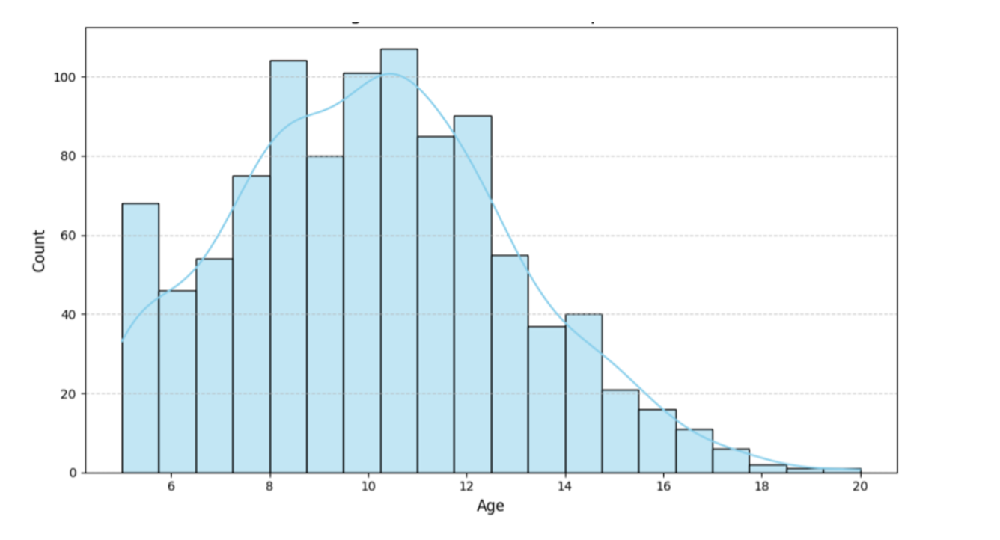

# Predicting Problematic Internet Use Using Physical Activity Data

## Overview

This project explores the relationship between physical activity patterns and problematic internet use (PIU) among youth. Using the **Healthy Brain Network (HBN)** dataset, we built predictive models to classify the Severity Impairment Index (SII), a standardized measure of PIU, into four levels: None, Mild, Moderate, and Severe.  

This is a part of kaggle competition which aims to improve early identification and intervention for PIU, contributing to healthier digital habits and mental well-being.

## Dataset

### Source
- **Healthy Brain Network (HBN)**: Approximately 5,000 participants aged 5-22 years.  
- Data types:  
  - **Tabular data**: Demographics, fitness measures, sleep disturbances, and internet usage behaviors.  
  - **Time-series data**: Accelerometer readings (5-second intervals) spanning multiple days.  

### Key Features
- Physical activity metrics: ENMO, arm angle, etc.  
- Internet usage behaviors: Hours of use, SII classifications.  
- Derived metrics: Body composition, sleep disturbances, and physical activity levels.  

## Methodology

### Project Workflow
1. **Data Preprocessing**: Handling missing values, feature scaling, and imputation.  
2. **Exploratory Data Analysis**: Visualized patterns in internet usage, physical measures, and activity data.  
3. **Feature Engineering**: Combined tabular and time-series data into enriched feature sets.  
4. **Modeling**: Utilized machine learning and deep learning models to predict SII.  
5. **Evaluation**: Submitted predictions to Kaggle and analyzed performance using Quadratic Weighted Kappa (QWK).  

### Models Implemented
- **TabNet Classifier**: Focused on tabular data with attention-based feature selection.  
- **Custom TabNet Wrapper**: Optimized implementation with preprocessing and cross-validation.  
- **LSTM and Siamese LSTM**: Modeled sequential patterns in time-series data.  
- **Multi-Layer Perceptron (MLP)**: Efficient handling of tabular features.  
- **Voting Regressor Ensemble**: Combined predictions from LightGBM, XGBoost, CatBoost, and TabNet for robust results.

### Key Challenges
- Managing class imbalances (handled using Borderline-SMOTE).  
- Integrating tabular and time-series data.  
- Missing values in test datasets, requiring advanced imputation techniques.  

## Results

| Model                          | QWK Score (Train) | QWK Score (Validation) | Kaggle Score |
|--------------------------------|-------------------|-------------------------|--------------|
| TabNet Ensemble Classifier     | 0.4271            | 0.391                  | 0.391        |
| Custom TabNet Wrapper          | 0.477             | 0.303                  | 0.303        |
| LSTM                           | 0.3283            | 0.310                  | 0.310        |
| MLP                            | 0.3694            | 0.316                  | 0.316        |
| Siamese LSTM                   | 0.297             | 0.327                  | 0.327        |
| Voting Regressor with TabNet   | **0.450**         | **0.494**              | **0.494**    |

### Highlights
- The **Voting Regressor Ensemble** achieved the highest Kaggle score of 0.494, demonstrating robust performance.  
- Visualizations revealed critical correlations between physical activity and SII severity.  

## Visualizations

- Gender and age distributions.  
- Internet usage trends across SII categories.  
- Physical activity and sleep disturbance scores correlated with SII.  

Sample visualization:  

  

## Contributions

This project was developed as part of the Data 255 course at San Jose State University. This is a team project for academic purposes. If you find any issues or have suggestions, feel free to open a GitHub issue.

## Acknowledgments

- Kaggle for hosting the competition [(Kaggle Competition Link)](https://www.kaggle.com/competitions/child-mind-institute-problematic-internet-use/overview)
- The Child Mind Institute for providing the dataset and research inspiration.

## Contact

For questions or additional information, please reach out via:
- **GitHub Issues**: [Open an Issue](https://github.com/svarshneysjsu/Paraphrase-Detection-with-Quora-Question-Pairs/issues)